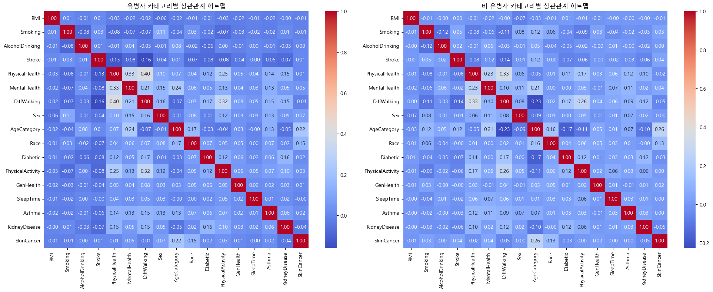
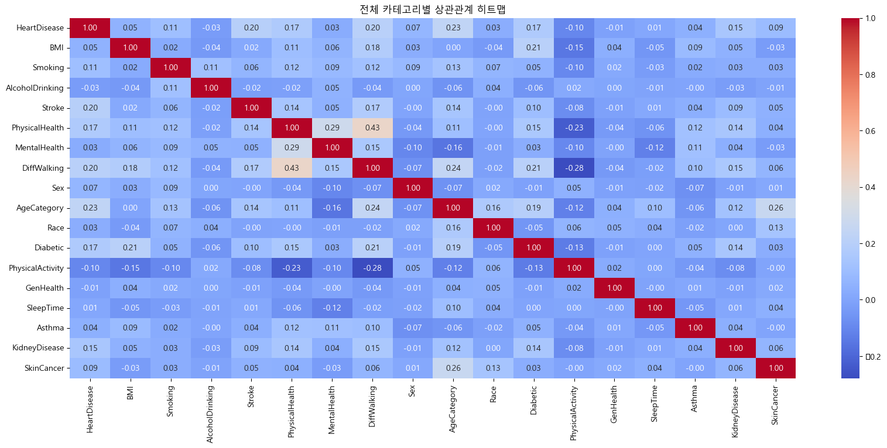

## healthcare_team (심장질환 예측 머신러닝 프로젝트)

### 개요

21세기의 과학 발전과 의료 산업의 발달은 건강에 대한 사람들의 인식을 크게 바꿔놓았습니다. 특히 심장 질환은 그 중요성 때문에 많은 사람들이 심각하게 고민하는 문제 중 하나입니다. 이러한 상황에서는 CPR(Cardiopulmonary Resuscitation) 같은 응급 처치에 대한 교육도 더욱 중요해졌을 것입니다. 그리고 이러한 환경에서 우리는 DNA 정보 뿐만 아니라 행동 데이터와 질병 데이터를 결합하여 심장 질환을 예측하는 방법을 모색해야 한다는 생각을 하게 되었습니다. 이를 위해 데이터 기반의 머신러닝 알고리즘을 활용하여 주어진 정보로부터 심장 질환을 예측해 보기로 했습니다.

### 멤버
- 요한, 석천, 주현

||산출물|
|--|--|
|박요한|[ML 정리](./docs/yohan/README.md) / [분석 ipynb](./docs/yohan/Analysis/helth_analysis.ipynb)|
|문석천||
|노주현||

### 결과

- 요한

[Analysis]



- 나이, 보행정도, 운동여부, 당뇨, 신장질환순으로 위험도 발생

[ML]


최종 성능
```
randomForestClassifier 모델

              precision    recall  f1-score   support

           0       0.90      0.90      0.90     84882
           1       0.87      0.88      0.88     68051

    accuracy                           0.89    152933
   macro avg       0.89      0.89      0.89    152933
weighted avg       0.89      0.89      0.89    152933
```

<details>
<summary>회의록</summary>

## 약속
- 작업 시 특이사항 슬랙에 남기기 


## 해야할 일
- 회의록
- 스케줄
- 데이터 분석 담당 분류


## 데이터
- ~~[한국건강증진개발원_보건소 모바일 헬스케어 서비스](https://www.data.go.kr/data/15068787/fileData.do#tab-layer-file)~~
- ~~[한국건강증진개발원_보건소 모바일 헬스케어_체성분](https://www.data.go.kr/data/15091595/fileData.do#tab-layer-file)~~
- ~~[한국건강증진개발원_보건소 모바일 헬스케어_활동](https://www.data.go.kr/data/15091596/fileData.do#tab-layer-file)~~
- [heart disease 2020](https://www.kaggle.com/datasets/aqleemkhan/heart-disease-2020/data)
- ~~[diabetes Health indicators](https://www.kaggle.com/datasets/alexteboul/diabetes-health-indicators-dataset)~~
- ~~[mental health](https://www.kaggle.com/datasets/dhivyeshrk/diseases-and-symptoms-dataset/data)~~

## 1차 회의(2024.02.27)
### project process
<details>
<summary>상세 보기</summary>

#### 1. 타겟
- 보건소의 모바일 헬스케어 서비스 develop
#### 2. 데이터
- 신체활동 : 안전 시 목표 심박수, 상담 차수, 활동 처방 구분, 하루활동 칼로리, 하루 활동 시간, 활동유효한계
- 체성분: 체중, 체질량지수
- 상담 : 운동상담, 영양상담, 건강상담
#### 3. 로드맵
- 신체활동, 체성분, 상담 데이터를 바탕으로 고객들을 grouping 해서 맞춤 서비스 제공 
</details>
 
### 과제
<details>
<summary>상세 보기</summary>

- 신체활동, 생체 데이터, 만성질환자 관련 데이터 더 가져오기
</details>

## 2차 회의(2024.02.29)
### 머신러닝 모델링 방식 선택
- 비지도 학습 : Clustering 
- 진행 과정
    + 개인 과정
    1. 데이터 전처리
    2. 비지도 학습
    3. 군집 분석 
    + 그룹 과정
    4. 군집 분석 회의
    5. 분석 데이터 merge
    6. 주제 추출 : 분류 & 결론 도출
    7. 최종 전략 제시 


### 과제
- heart disease 데이터 분석하기
- 진행과정 : 데이터 전처리 -> 군집화 -> 군집화 기준 생각 -> 방향성 생각

## 3차 회의(2024.03.4)
### 군집화 결과 공유 및 방향성 재 설정
- 데이터 간의 불균형이 심해 군집화가 제대로 되지 않음
- 그래서 이 데이터를 군집화하는 것 보다는 심장병 유무를 판단하는 분류 모델 작성이 적절하다고 판단
- 분류 모델의 성능을 높이는 방향으로 진행하기로 결정

### 과제
- 분류 모델 성능 향상시켜 보기


## 4차 회의(2024.03.11)
### 각 모델 제작 결과 공유
- 분류 모델을 제작 방식에 대한 의견 교류

### 과제
- 각자 한 내용에 대한 PPT 만들어 오기

</details>
