# 요한 ML README

## 진행 순서
||내용|코드|
|--|--|--|
|1|전처리 / 분류 모델 적용|[ipynb](yohan_analystics_step1.ipynb)|
|2|데이터 재 전처리 / 모델 Optimizing|[ipynb](yohan_analystics_step2.ipynb)|
|3|모델 선정|[ipynb](yohan_analystics_step3.ipynb)|
|4|Optimizing|[ipynb](yohan_analystics_step4.ipynb)|


## Step.1 데이터 전처리

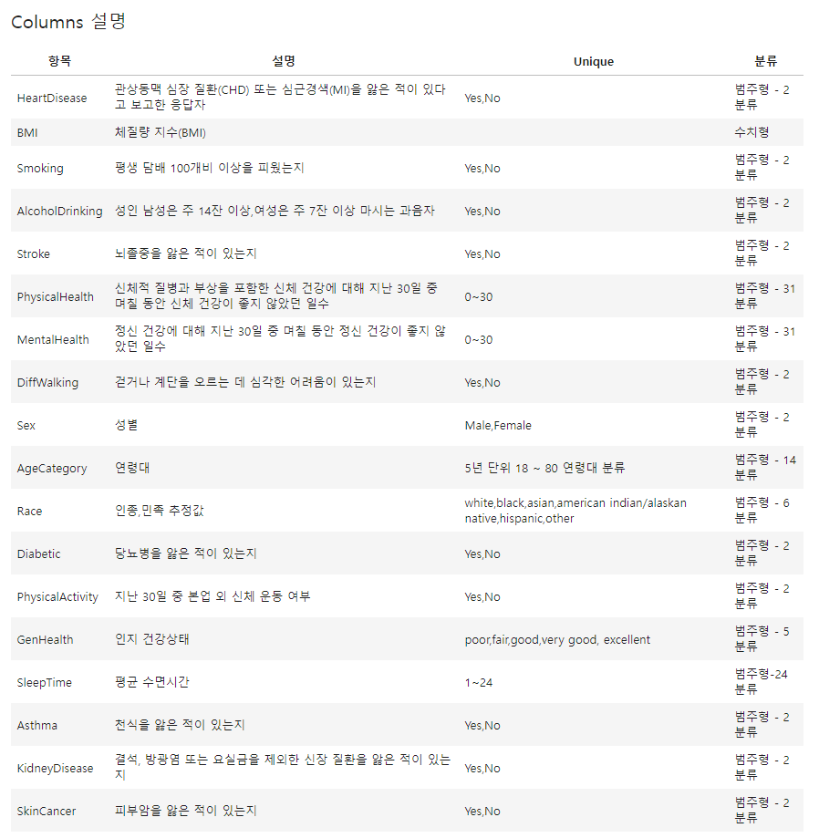

- 결측치 X


### 이상치 

- 수치형 데이터에 대한 이상치 검증

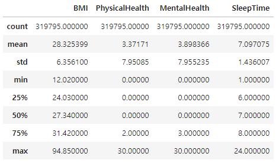
```
이 중 PhysicalHealth(신체 건강), MentalHealth(정신 건강)은 숫자로 된 설문형 데이터로 범주형 데이터

SleepTime도 동일하나 일반적인 수면시간과 동떨어져있는 값이 있는 것으로 확인됌 (min, max)
```

#### SleepTime
- 하루 평균 성인 수면시간(7~8)의 절반(4시간)과 두배 이상(16시간)이 넘어가는 데이터를 확인


```
- 4시간 이하에서 1시간으로 응답한 수가 매우 많은 것으로 보았을 때, 자신의 평균 수면시간을 과장하여서 대답한 것으로 판단
- 10시간 이상에서 선을 점점 크게 벗어남 -> 이상치의 그룹을 하나로 묶어서 계산, 그러나 선을 벗어나는 11시간 이상으로 할지 본디 예상했던 16시간 이상으로 할지 생각해봐야함
```
> 각 4시간,11시간을 벗어나는 그룹을 하나의 범주로 묶어서 적은 수면, 과다 수면으로 설정하고 각 경계 그룹에 편입 후 분석

#### BMI
- 정규성에 따라 IQR or 3sigma를 사용하여 이상치 제거
- low 갯수가 5,000개 이상이므로 Anderson Test로 정규성 확인


- Anderson Test

||수치|
|--|--|
|statistic|4439.45398043585|
|critical_values|0.576, 0.656, 0.787, 0.918, 1.092|
|significance_level|15. , 10. ,  5. ,  2.5,  1. |
|FitParams|loc=28.325398520927465, scale=6.356100200470739|
```
anderson test 결과
- statistic=4439.45398043585
- critical_values=array([0.576, 0.656, 0.787, 0.918, 1.092])
모든 구간(15%~1%) 수준에서 검정통계량이 더 크므로 정규분포를 따르지 않는다고 판단
따라서 IQR 이상치 제거법으로 이상치 제거
```
>이상치 제거 전 low 갯수 :  319795 -> 이상치 제거 후 low 갯수 :  309399

### 전처리

#### Diabetic

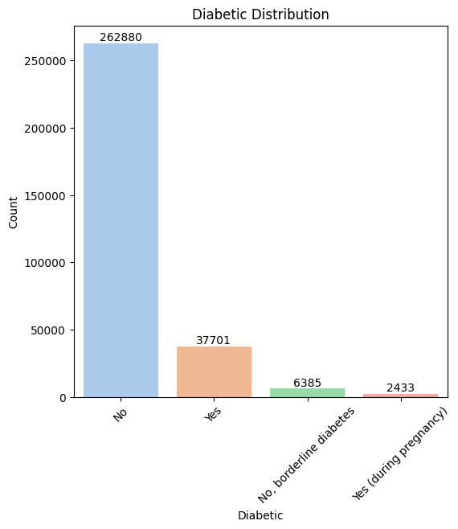

- 해당 갯수가 크지 않다고 판단, 각 상위 그룹에 편입진행

> 본 예측은 최대한 보수적으로 예측을 위해 아래와 같이 집행 (건강관련이므로)

- 임신성 당뇨는 특수한 경우이므로 No그룹으로 편입
- 경계성 당뇨는 어느 정도 당뇨에 대한 진행이 이루어지고 있으므로 Yes그룹으로 편입

## Step.2 Scaling

- step.1에서 DecisionTreeClassifier 진행 결과

||precision|recall|f1-score|support|
|--|--|--|--|--|
|0|0.93|0.92|0.93|84920|
|1|0.23|0.25|0.24|7900|
|accuracy|||0.87|92820|
|macro avg|0.58|0.59|0.58|92820|
|weighted avg|0.87|0.87|0.87|92820|

> 테스트로 돌려본 모델에서 f1-score가 매우 낮은 것을 확인

- 벨런스가 무너진 데이터 셋임을 이제서야 확인
- 격차를 줄이기 위해 oversampling 진행

### OverSampling

- 모 델 : imblearn.SMOTE
- 샘플비율 : 0.8

#### oversampling 이후 DecisionTreeClassifier 결과

- test_split 비율  7:3

(데이터 재 전처리 후 재진행)

||precision|recall|f1-score|support|
|--|--|--|--|--|
|0|0.88|0.86|0.87|87604|
|1|0.83|0.85|0.84|70304|
|accuracy|||0.86|157908|
|macro avg|0.86|0.86|0.86|157908|
|weighted avg|0.86|0.86|0.86|157908|

## Step.3 모델 선정

- 최적의 모델을 찾기 위해 여러 모델을 직접 테스팅

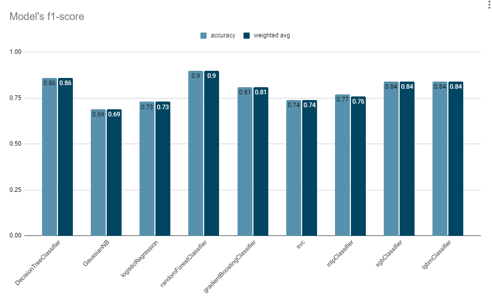

> RandomForestClassifier모델이 가장 높은 성능을 보여줌

## Step.4 Optimization

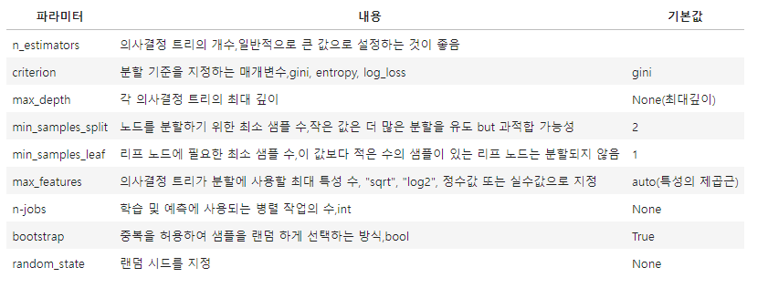

### n_estimators

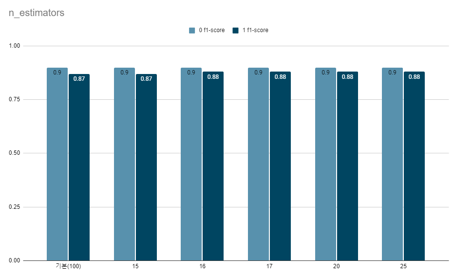

- 최적값 16

### max_depth

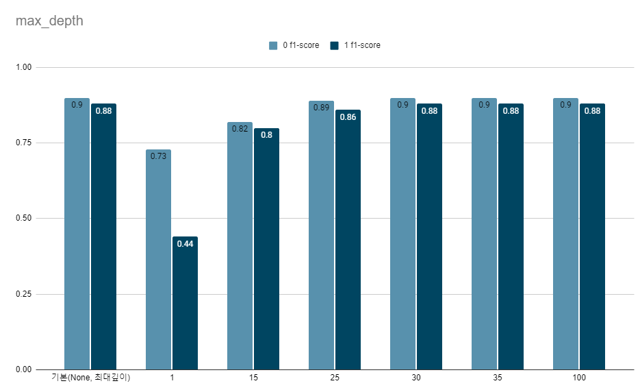

- 기본값이 최적값

### min_samples_split

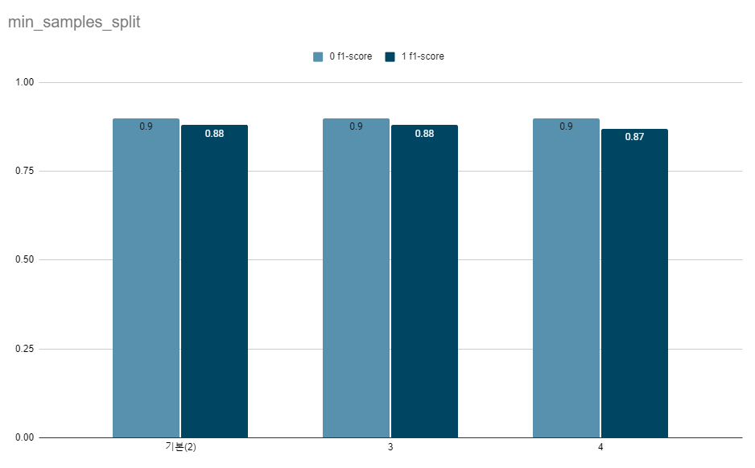

- 최적값 = 2~3

### min_samples_leaf

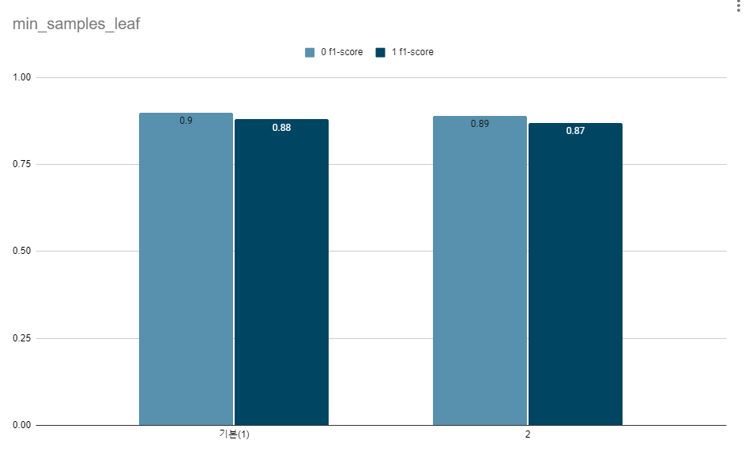

- 최적값 = 1


### max_features

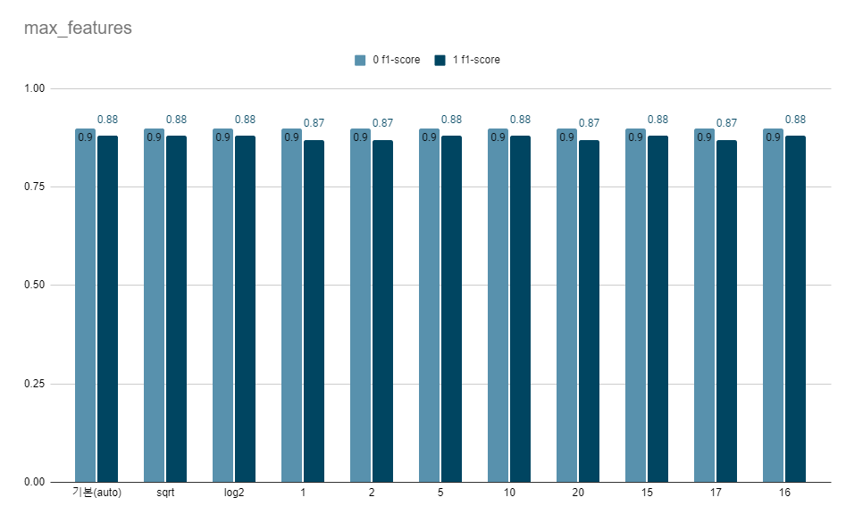


### criterion

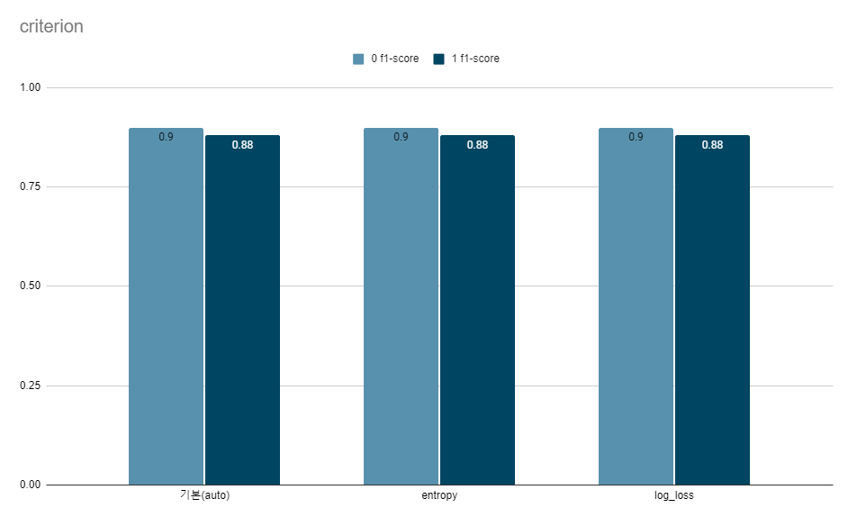


### best optimization

|파라미터|값|
|--|--|
|n_estimators|16|
|max_depth|None(최대깊이)|
|min_samples_split|2|
|min_samples_leaf|1|
|max_features|None(auto)|
|criterion|None(auto)|


```
최종 성능

randomForestClassifier 모델

              precision    recall  f1-score   support

           0       0.90      0.90      0.90     84882
           1       0.87      0.88      0.88     68051

    accuracy                           0.89    152933
   macro avg       0.89      0.89      0.89    152933
weighted avg       0.89      0.89      0.89    152933
```


## 후기
|발생단계|내용|해결|고찰|
|--|--|--|--|
|전처리|BMI와 SleepTime 이상치 처리|각각 Q-Q plot 검정과 정규성을 통한 재처리 진행|전문 분야가 아니다보니 어느정도까지가 적정선인지 몰라서 기계적인 이상치 처리를 하게되어 아쉬웠다. 1단계에 의한 이상치 처리만 하였으나 조금 더 처리하여 모델의 성능을 이끌어 낼 수 있지 않을가 하는 생각이 들었다.|
|Scaling|자료의 불균형으로 인한 데이터 처리|overscaling을 진행|over뿐만 아니라 under, min/max도 한번 테스해봤으면 어땠을까? 단순히 데이터가 줄어드는 것을 걱정해서 overscaling을 사용했는데 아쉬움이 남는다.|
|Optimization|randomForestClassifier의 최적화|눈으로 확인해보고 싶어서 파라미터마다 하나하나 수작업|GridSearchdCV를 사용해서 한번에 하는 방법도 있었긴 한데 처음 생각했을 때는 각 모델당 파라미터가 달라서 하기 힘들것이라고 생각했던것 같다. 모델 선정 후 하면 된다는 것을 다시 한번 상기하게 되었다.|